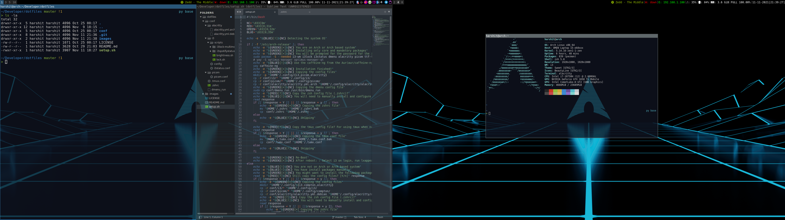

# dotfiles

My dotfiles mainly for i3 setup, with Picom and Alacritty. 

## Setting up a fresh environment 

If you are on [Arch](https://archlinux.org/) or Arch Based Distro like [Garuda Linux](https://garudalinux.org/), [Manjaro](https://manjaro.org/), [ArcoLinux](https://arcolinux.com/)... then just run the setup.sh script. 

You will be prompted for the passwod to install the necessary packages. And dont run the script as `root` otherwise the config files will be placed on the root's home directory.

And if you are not on Arch Based Distro, then it will promt you the necessary packages which needs to be installed and will ask to weather to copy the config files or not.

### Mod Key

Mod($mod) Key is Windows/Super.
Mod1($mod1) Key is Alt.

### power-manager/lock-screen

Initiall I was using 'xautolock' to auto-lock the screen and to put the system to sleep. But its was not good enough for me, as its locks the screen when I was using VLC and some other apps which prevents screen to lock. So I switched to the previous manger(xfce4-power-manger). 
And I am using xfce4-screensaver to lock my screen as they share the same configs, so if the screen is going to turn off from the xfce4-power-manger settings xfce4-screensaver locks it.

It just works so fine for me.
 
### Distro based package name

Picom/Compton:
 - I am on Arch Based system so for me its Picom. And for Debian based system is Compton.
 

## Ref's:
  - Shows current track playing on Spotify -> [https://github.com/rpieja/i3spotifystatus](https://github.com/rpieja/i3spotifystatus)

  - i3 lock for Dual-Display -> [https://github.com/ShikherVerma/i3lock-multimonitor](https://github.com/ShikherVerma/i3lock-multimonitor)

